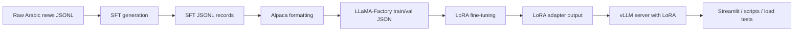

# Ara-FineTune

Ara-FineTune is an Arabic NLP fine-tuning pipeline focused on two structured-generation tasks:

1. Arabic news details extraction into a strict JSON schema.
2. Arabic to target-language translation into a strict JSON schema.

The repository covers the full workflow:

- synthetic SFT generation from raw news articles,
- dataset formatting for LLaMA-Factory,
- LoRA fine-tuning on Qwen2.5,
- vLLM serving with LoRA adapter support,
- Streamlit-based interactive inference,
- offline evaluation and load testing.

## What This Project Does

The project is built around a single fine-tuning loop:

1. Start from raw Arabic news articles in JSONL format.
2. Use a cloud model through an OpenAI-compatible API to distill structured training examples.
3. Convert those examples into LLaMA-Factory Alpaca format.
4. Fine-tune a base model with LoRA.
5. Serve the base model plus LoRA adapter with vLLM.
6. Run inference from scripts, Streamlit, or load testing tools.

The default base model in the repo is `Qwen/Qwen2.5-1.5B-Instruct`.

## Repository Layout

```text
app/
  streamlit_app.py        # Streamlit inference UI
configs/
  news_finetune.yaml      # LLaMA-Factory training config
data/
  DataSet/                # Raw/working data directory
scripts/
  build_dataset.py        # Convert distilled SFT into LLaMA-Factory splits
  evaluate_tasks.py       # Offline task evaluation
  generate_sft.py         # Generate synthetic SFT from raw news
  serve_vllm.sh           # Start vLLM with LoRA support
  setup_llamafactory.sh   # Helper for LLaMA-Factory setup
  train.py                # Launch LLaMA-Factory training
src/
  data/                   # Loaders, SFT builder, formatter
  inference/              # Shared inference helpers
  load_testing/           # Locust load test and token analyzer
  models/                 # Base, PEFT, OpenAI, and vLLM wrappers
  schemas/                # Pydantic schemas for structured outputs
  tasks/                  # Prompt builders for each task
```

## End-to-End Pipeline



## Prerequisites

You need:

- Python 3.10+ recommended.
- A CUDA-capable GPU for training and local inference.
- Access to a base model from Hugging Face, by default `Qwen/Qwen2.5-1.5B-Instruct`.
- `llamafactory-cli` available in your environment for training.
- An OpenAI-compatible API key if you want to generate synthetic SFT data from a cloud model.

Install the Python dependencies first:

```bash
pip install -r requirements.txt
```

The repository also expects LLaMA-Factory to be installed separately so that the `llamafactory-cli` command exists in your shell.

## Environment Variables

The scripts and UI read configuration from `.env` when available.

Recommended variables:

```bash
# Base model and LoRA serving
BASE_MODEL_ID=Qwen/Qwen2.5-1.5B-Instruct
# LORA_PATH is the shared adapter/checkpoint directory for training and vLLM loading.
LORA_PATH=/gdrive/MyDrive/ara-finetune/models
LORA_MODULE_NAME=news-lora
VLLM_ENDPOINT=http://localhost:8000
VLLM_MODEL_ID=news-lora

# SFT generation
OPENAI_API_KEY=your_key
OPENAI_BASE_URL=https://openrouter.ai/api/v1
CLOUD_MODEL_ID=openai/gpt-oss-120b:free
RAW_DATA_PATH=/gdrive/MyDrive/ara-finetune/datasets/news-sample.jsonl
SFT_SAVE_PATH=/gdrive/MyDrive/ara-finetune/datasets/sft.jsonl

# Dataset formatting
LLAMAFACTORY_DATA_DIR=/gdrive/MyDrive/ara-finetune/datasets/llamafactory-finetune-data
TRAIN_SIZE=2700

# vLLM serving
VLLM_PORT=8000
GPU_MEMORY_UTILIZATION=0.90
MAX_MODEL_LEN=3000
```

If you do not set these values, the scripts fall back to the defaults embedded in the code. Some of those defaults still point to `/gdrive/...`, so in a local environment you usually want to override them.

## Raw Data Format

The synthetic data generation script expects JSONL input where each line is a news record containing at least a `content` field.

Example:

```json
{"content":"...Arabic news article text..."}
```

## Step 1: Generate Synthetic SFT Data

This repository uses a cloud model to create structured supervision for two tasks:

- details extraction,
- translation.

Run:

```bash
python scripts/generate_sft.py
```

What the script does:

1. Loads `OPENAI_API_KEY` and optional `OPENAI_BASE_URL`.
2. Reads raw news from `RAW_DATA_PATH`.
3. Builds task-specific prompts using the prompt builders in `src/tasks/`.
4. Calls the cloud model through `src/models/openai_model.py`.
5. Repairs and parses the JSON response with `src/inference/utils.py`.
6. Appends structured records to `SFT_SAVE_PATH`.

The generated intermediate record format contains:

- `id`
- `story`
- `task`
- `output_scheme`
- `response`

## Step 2: Format Data for LLaMA-Factory

Convert the generated SFT JSONL into Alpaca-style JSON files for LLaMA-Factory:

```bash
python scripts/build_dataset.py
```

What the formatter produces:

- `train.json`
- `val.json`

These files are written into `LLAMAFACTORY_DATA_DIR`.

Each sample is converted to a structure with:

- `system`
- `instruction`
- `input`
- `output`
- `history`

The formatter injects a fixed system prompt that tells the model to follow the task and output scheme and to return JSON only.

## Step 3: Train with LLaMA-Factory

Use [scripts/setup_llamafactory.sh](scripts/setup_llamafactory.sh) to prepare LLaMA-Factory.

Run it from the repository root:

```bash
./scripts/setup_llamafactory.sh
```

That setup script does the setup work you need before training:

1. Clones LLaMA-Factory from source.
2. Installs it in editable mode with `pip install -e .`.
3. Reads your `.env` values.
4. Injects `news_finetune_train` and `news_finetune_val` into `LLaMA-Factory/data/dataset_info.json` using your dataset paths.
5. Generates `LLaMA-Factory/examples/train_lora/news_finetune.yaml` from your environment values.

The checked-in [configs/news_finetune.yaml](configs/news_finetune.yaml) is a safe template, not the final runnable config.
Use the generated YAML under `LLaMA-Factory/examples/train_lora/news_finetune.yaml` when you actually train.

The dataset registration it adds looks like this:

```json
"news_finetune_train": {
  "file_name": "/gdrive/MyDrive/ara-finetune/datasets/llamafactory-finetune-data/train.json",
  "columns": {
    "prompt": "instruction",
    "query": "input",
    "response": "output",
    "system": "system",
    "history": "history"
  }
},
"news_finetune_val": {
  "file_name": "/gdrive/MyDrive/ara-finetune/datasets/llamafactory-finetune-data/val.json",
  "columns": {
    "prompt": "instruction",
    "query": "input",
    "response": "output",
    "system": "system",
    "history": "history"
  }
}
```

Training is then launched through:

```bash
cd LLaMA-Factory && llamafactory-cli train /content/LLaMA-Factory/examples/train_lora/news_finetune.yaml
```

You can still use the repository wrapper if you prefer:

```bash
python scripts/train.py configs/news_finetune.yaml
```

When no path is passed, the wrapper prefers the generated LLaMA-Factory config under `LLaMA-Factory/examples/train_lora/news_finetune.yaml` and falls back to [configs/news_finetune.yaml](configs/news_finetune.yaml) if needed.

The underlying command is:

```bash
llamafactory-cli train configs/news_finetune.yaml
```

### LLaMA-Factory Config Explained

The main training config is [configs/news_finetune.yaml](configs/news_finetune.yaml).

Important sections:

#### Model

```yaml
model_name_or_path: Qwen/Qwen2.5-1.5B-Instruct
trust_remote_code: true
```

This selects the base model and allows custom model code if needed.

#### Method

```yaml
stage: sft
do_train: true
finetuning_type: lora
lora_rank: 64
lora_target: all
```

This means the project performs supervised fine-tuning with LoRA adapters applied across all supported modules.

#### Dataset

```yaml
dataset: news_finetune_train
eval_dataset: news_finetune_val
template: qwen
cutoff_len: 3500
overwrite_cache: true
preprocessing_num_workers: 16
```

This tells LLaMA-Factory which named datasets to load and which chat template to use.

The dataset names must match how you register or prepare the JSON files inside your LLaMA-Factory data directory.

#### Output

```yaml
output_dir: /gdrive/MyDrive/ara-finetune/models/
logging_steps: 10
save_steps: 500
plot_loss: true
```

This is where checkpoints and adapter artifacts are written.

#### Train

```yaml
per_device_train_batch_size: 1
gradient_accumulation_steps: 4
learning_rate: 1.0e-4
num_train_epochs: 3.0
lr_scheduler_type: cosine
warmup_ratio: 0.1
bf16: true
```

These values define the optimization strategy used in fine-tuning.

#### Eval

```yaml
per_device_eval_batch_size: 1
eval_strategy: steps
eval_steps: 100
```

#### Hub / Logging

```yaml
report_to: wandb
run_name: newsx-finetune-llamafactory
push_to_hub: true
hub_model_id: "Gamal1/news-analyzer"
hub_private_repo: true
hub_strategy: checkpoint
```

These settings enable experiment tracking and optional model pushing.

### What You Need Before Training

Before running the training script, make sure:

- `scripts/setup_llamafactory.sh` has been run successfully.
- `.env` contains the dataset paths, model path, output directory, and hub IDs you want to use.
- `llamafactory-cli` is available.
- The dataset JSON files are in the expected LLaMA-Factory data location.
- The output directory is writable.
- Your GPU has enough memory for the chosen base model and sequence length.

### Practical Training Sequence

1. Prepare raw news JSONL.
2. Generate SFT records with `scripts/generate_sft.py`.
3. Build LLaMA-Factory train/val files with `scripts/build_dataset.py`.
4. Update [configs/news_finetune.yaml](configs/news_finetune.yaml) if you want to change the base model, LoRA rank, or output directory.
5. Run `python scripts/train.py`.
6. Collect the LoRA adapter from `output_dir`.

## Step 4: Serve the Fine-Tuned Model with vLLM

Start the server with:

```bash
bash scripts/serve_vllm.sh
```

The server script does the following:

1. Loads environment variables from `.env` if present.
2. Uses `BASE_MODEL_ID`, `LORA_PATH`, `LORA_MODULE_NAME`, `VLLM_PORT`, `GPU_MEMORY_UTILIZATION`, and `MAX_MODEL_LEN`.
3. Starts `vllm.entrypoints.openai.api_server` in the background.
4. Exposes an OpenAI-compatible completions endpoint at `/v1/completions`.

Default behavior in the script:

- base model: `Qwen/Qwen2.5-1.5B-Instruct`
- served model name: `qwen-base`
- LoRA module name: `news-lora`
- port: `8000`
- max model length: `3000`
- LoRA rank limit: `64`

The script also writes logs to `logs/vllm.log`.

### vLLM Inference Flow

The vLLM client in `src/models/vllm_model.py` works like this:

1. Load the tokenizer for the base model.
2. Convert chat messages into a prompt with the chat template.
3. Send the prompt to the vLLM completions endpoint.
4. Attach LoRA module metadata when `lora_name` and `lora_path` are set.
5. Read the generated text from the response.

This means the server can stay generic while the adapter is selected at request time.

## Step 5: Run Interactive Inference

The main UI is [app/streamlit_app.py](app/streamlit_app.py).

Run it with:

```bash
streamlit run app/streamlit_app.py
```

The app provides:

- a details extraction tab,
- a translation tab,
- request history,
- architecture notes,
- live token and latency metrics.

### Streamlit Runtime Requirements

The UI expects:

- a running vLLM server,
- a valid `BASE_MODEL_ID`,
- the correct `LORA_PATH` and `LORA_MODULE_NAME`,
- the vLLM endpoint URL in `VLLM_ENDPOINT`.

### UI Inference Behavior

For each request, the app:

1. Builds task-specific messages with the prompt builders in `src/tasks/`.
2. Applies the tokenizer chat template from the base model.
3. Sends the prompt to vLLM.
4. Measures latency.
5. Attempts to parse the returned text as JSON.
6. Displays the raw or parsed output.

## Step 6: Offline Evaluation

Run the evaluation script with one of the supported backends:

```bash
python scripts/evaluate_tasks.py --model-type vllm
python scripts/evaluate_tasks.py --model-type base
python scripts/evaluate_tasks.py --model-type finetuned
python scripts/evaluate_tasks.py --model-type openai
```

Supported model types:

- `base`: local Hugging Face model without LoRA
- `finetuned`: local Hugging Face model with a loaded adapter
- `openai`: OpenAI-compatible API client
- `vllm`: local vLLM completions server with LoRA

The script evaluates both tasks using the same prompt builders as the UI.

## Step 7: Load Testing

The load-testing entrypoint is [src/load_testing/locustfile.py](src/load_testing/locustfile.py).

Run:

```bash
locust -f src/load_testing/locustfile.py
```

This will:

- generate Arabic prompts with Faker,
- POST them to `/v1/completions`,
- optionally attach LoRA metadata,
- store responses in a JSONL token log for later analysis.

Analyze token usage with:

```bash
python src/load_testing/token_analyzer.py ./vllm_tokens.txt Qwen/Qwen2.5-1.5B-Instruct
```

## Task Schemas

### Details Extraction

The extraction task produces a strict JSON object with:

- `story_title`
- `story_keywords`
- `story_summary`
- `story_category`
- `story_entities`

The entity structure includes:

- `entity_value`
- `entity_type`

### Translation

The translation task produces:

- `translated_title`
- `translated_content`

## Common Files and Their Roles

- [scripts/generate_sft.py](scripts/generate_sft.py): distill supervised examples from raw stories.
- [scripts/build_dataset.py](scripts/build_dataset.py): convert the distilled JSONL into train/val files.
- [configs/news_finetune.yaml](configs/news_finetune.yaml): LLaMA-Factory fine-tuning config.
- [scripts/train.py](scripts/train.py): launch the training job.
- [scripts/serve_vllm.sh](scripts/serve_vllm.sh): start the vLLM server with LoRA.
- [app/streamlit_app.py](app/streamlit_app.py): interactive inference UI.
- [src/models/model_factory.py](src/models/model_factory.py): create the correct backend wrapper.

## Troubleshooting

If training does not start:

- verify `llamafactory-cli` is installed and on `PATH`.
- check that `configs/news_finetune.yaml` points to the correct dataset names and model path.
- confirm the output directory exists or can be created.

If vLLM does not serve requests:

- confirm the server is running and `logs/vllm.log` is not showing a startup failure.
- make sure `VLLM_ENDPOINT` matches the server port.
- verify the LoRA adapter path is correct.

If the Streamlit app cannot connect:

- start vLLM first.
- check `VLLM_ENDPOINT`, `VLLM_MODEL_ID`, `LORA_PATH`, and `LORA_MODULE_NAME`.

If JSON parsing fails:

- inspect the model output for incomplete JSON.
- ensure the response is not truncated by `max_tokens` or `MAX_MODEL_LEN` limits.

## Suggested Run Order

1. Install dependencies.
2. Set `.env` values.
3. Generate SFT records.
4. Build the LLaMA-Factory dataset.
5. Train the LoRA adapter.
6. Start vLLM.
7. Run Streamlit, evaluation, or load testing.

## License

Add your project license here if you want to publish or share the repository.