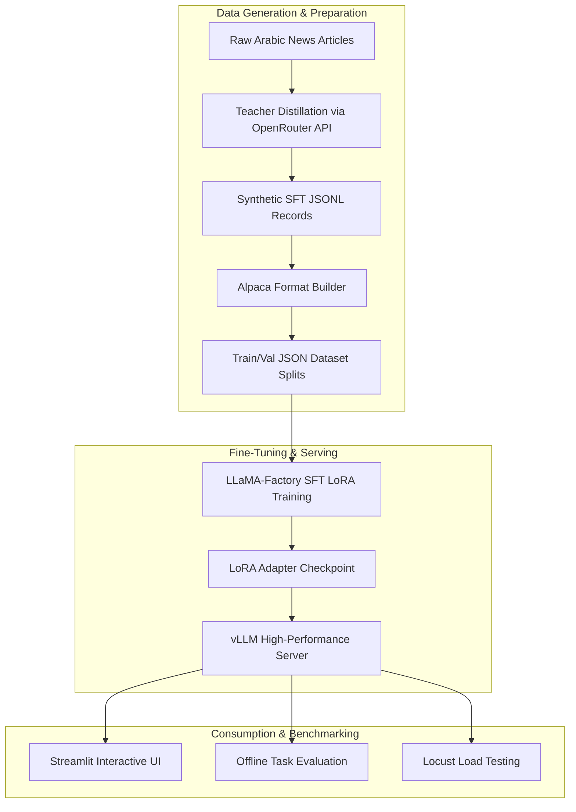

# Ara-FineTune

**Ara-FineTune** is an end-to-end Arabic Natural Language Processing (NLP) fine-tuning and inference pipeline designed to transform raw, unstructured Arabic news articles into strict, machine-readable JSON schemas for two core business tasks:

1. **Arabic News Details Extraction** into a strict JSON schema (`NewsDetails`).
2. **Arabic to Target-Language News Translation** into a strict JSON schema (`Translation`).

The repository covers the full lifecycle from synthetic SFT data generation via Knowledge Distillation to Parameter-Efficient Fine-Tuning (PEFT/LoRA), high-performance vLLM serving, interactive UI testing, offline evaluation, and load testing.

---

## Business Problem

### 1. Unstructured Arabic Media Streams
Modern media agencies, news aggregators, intelligence platforms, and digital publishers digest massive volumes of raw, unstructured Arabic text daily. Extracting actionable insights from this text requires multiple operations:
- **SEO & Metadata Generation:** Formulating optimized headlines and relevant keywords.
- **Content Categorization:** Classifying articles into standardized taxonomy (e.g., Politics, Economy, Tech, Sports).
- **Executive Summarization:** Distilling long articles into 1–5 concise keypoints.
- **Named Entity Recognition (NER):** Identifying key individuals, organizations, locations, quantities, and events.
- **Cross-Lingual Distribution:** Translating news into target languages (English, French, etc.) for international syndication.

Performing these operations manually or with fragmented traditional NLP pipelines is slow, expensive, inconsistent, and difficult to scale.

### 2. Drawbacks of Commercial LLM APIs
While cloud LLMs (such as GPT-4 or Claude) can handle these tasks, relying on commercial APIs for high-volume news stream processing presents significant operational challenges:
- **High Cost at Scale:** Per-token API pricing becomes exorbitant when processing millions of articles monthly.
- **Unpredictable Latency & Rate Limits:** Network dependency and third-party rate limits cause bottlenecks during breaking news spikes.
- **Data Privacy & Sovereignty:** Inability to host models on-premise or in private clouds for sensitive media feeds.
- **Vendor Lock-In:** Dependence on third-party API availability and schema changes.

### 3. Strict Schema Reliability Challenges
Standard open-source foundation models often struggle to reliably output strictly validated JSON matching precise Pydantic schemas out-of-the-box. Un-tuned models frequently introduce markdown formatting filler, missing keys, hallucinated entity types, or invalid JSON syntax, breaking downstream API integrations and database ingestion scripts.

---

## The Solution

**Ara-FineTune** solves these business challenges by building a domain-adapted, low-latency, self-hosted fine-tuning pipeline based on **Knowledge Distillation** and **LoRA (Low-Rank Adaptation)** applied to lightweight open-source foundation models (`Qwen/Qwen2.5-1.5B-Instruct`).



### Key Technical Pillars

- **Teacher-Student Knowledge Distillation:** Uses a high-capacity teacher model (e.g., `gpt-oss-120b`) to generate high-quality structured training pairs from raw news articles at minimal cost.
- **Parameter-Efficient Fine-Tuning (PEFT/LoRA):** Fine-tunes all linear projection modules (`lora_target: all`, rank `r=64`) on a 1.5B parameter base model, achieving commercial-grade schema compliance with minimal computational footprint.
- **High-Throughput Production Serving:** Deploys the trained LoRA adapter with **vLLM** via an OpenAI-compatible completion server for low-latency inference.
- **End-to-End Verification Suite:** Includes Streamlit UI for visual inspection, offline evaluation scripts for schema verification, and Locust load testing for benchmarking throughput under load.

---

## Detailed Breakdown of the 2 Core Tasks

| Feature | Task 1: Details Extraction | Task 2: Multilingual Translation |
| :--- | :--- | :--- |
| **Primary Goal** | Structured metadata & entity extraction | Cross-lingual structured translation |
| **Input** | Raw Arabic news article text | Raw Arabic news article + Target language |
| **Output Language** | Arabic (Same as input) | Target language (e.g., English, French) |
| **Target Schema** | `NewsDetails` Pydantic Schema | `Translation` Pydantic Schema |
| **Business Impact** | Enables auto-tagging, indexing & NER | Enables multi-language news syndication |

### Task 1: Arabic News Details Extraction (`news_extraction_task`)
Transform unstructured raw Arabic news articles into a structured JSON payload containing 5 core analytical components:

1. **`story_title`**: SEO-optimized, informative headline (5 to 300 characters).
2. **`story_keywords`**: Relevant indexing keywords/tags for search cataloging.
3. **`story_summary`**: Bullet-point executive summary (1 to 5 concise keypoints).
4. **`story_category`**: Standardized news categorization into one of 9 taxonomy buckets:
   `politics`, `sports`, `art`, `technology`, `economy`, `health`, `entertainment`, `science`, `not_specified`.
5. **`story_entities`**: Typed Named Entity Recognition (NER) mapping mentions to 13 specific entity types:
   `person-male`, `person-female`, `location`, `organization`, `event`, `time`, `quantity`, `money`, `product`, `law`, `disease`, `artifact`, `not_specified`.

#### Example Input:
> "أعلنت وزارة الصحة المصرية اليوم عن إطلاق حملة جديدة لتطعيم الأطفال ضد مرض شلل الأطفال في جميع المحافظات..."

#### Example Output (`NewsDetails` JSON):
```json
{
  "story_title": "إطلاق حملة موسعة للتطعيم ضد شلل الأطفال في جميع المحافظات المصرية",
  "story_keywords": ["وزارة الصحة", "حملة تطعيم", "شلل الأطفال", "مصر"],
  "story_summary": [
    "وزارة الصحة المصرية تطلق حملة طعيم جديدة ضد شلل الأطفال.",
    "الحملة تستهدف الأطفال في جميع المحافظات المصرية."
  ],
  "story_category": "health",
  "story_entities": [
    {"entity_value": "وزارة الصحة المصرية", "entity_type": "organization"},
    {"entity_value": "شلل الأطفال", "entity_type": "disease"},
    {"entity_value": "مصر", "entity_type": "location"}
  ]
}
```

---

### Task 2: Multilingual News Translation (`translation_task`)
Translates Arabic news stories into target languages (e.g., English, French) while restructuring the response directly into a clean JSON structure containing both headline and body content.

1. **`translated_title`**: High-quality translated title tailored for target audience readability.
2. **`translated_content`**: Complete, accurate translation of the news article content.

#### Example Output (`Translation` JSON - Target: English):
```json
{
  "translated_title": "Egyptian Ministry of Health Launches Nationwide Polio Vaccination Campaign",
  "translated_content": "The Egyptian Ministry of Health announced today the launch of a new campaign to vaccinate children against polio across all governorates..."
}
```

---

## Repository Layout

```text
Ara-FineTune/
├── app/
│   └── streamlit_app.py        # Interactive Streamlit web interface
├── configs/
│   └── news_finetune.yaml      # LLaMA-Factory training configuration template
├── data/
│   └── DataSet/                # Raw input data directory
├── scripts/
│   ├── generate_sft.py         # Step 1: Generate synthetic SFT data via distillation
│   ├── build_dataset.py        # Step 2: Format SFT JSONL into LLaMA-Factory splits
│   ├── setup_llamafactory.sh   # Step 3a: Helper script to install & configure LLaMA-Factory
│   ├── train.py                # Step 3b: Launch LLaMA-Factory LoRA fine-tuning
│   ├── serve_vllm.sh           # Step 4: Start high-throughput vLLM OpenAI server
│   └── evaluate_tasks.py       # Step 6: Offline benchmarking across model backends
├── src/
│   ├── data/                   # SFT data loaders, builders, and formatters
│   ├── inference/              # Robust JSON parsing and text cleanup utilities
│   ├── load_testing/           # Locust load testing script and token analyzer
│   ├── models/                 # Base HF, PEFT, OpenAI API, and vLLM wrapper classes
│   ├── schemas/                # Pydantic schema definitions (NewsDetails & Translation)
│   └── tasks/                  # Prompt builders for extraction and translation tasks
├── .env.example                # Template for environment configuration
└── requirements.txt            # Python dependencies
```

---

## Step-by-Step Execution Guide

### Prerequisites
- **Python:** 3.10+
- **GPU:** NVIDIA GPU with CUDA support (Minimum 16GB VRAM recommended for training/vLLM serving).
- **Dependencies:** Install requirements:
  ```bash
  pip install -r requirements.txt
  ```

---

### Environment Setup

Copy `.env.example` to `.env` and set your paths and keys:

```bash
cp .env.example .env
```

Key environment configuration variables:

```env
# Models & Paths
BASE_MODEL_ID=Qwen/Qwen2.5-1.5B-Instruct
LORA_PATH=/path/to/save/models/news-lora
LORA_MODULE_NAME=news-lora

# vLLM Server Settings
VLLM_ENDPOINT=http://localhost:8000
VLLM_MODEL_ID=news-lora
VLLM_PORT=8000
GPU_MEMORY_UTILIZATION=0.90
MAX_MODEL_LEN=3000

# SFT Data Generation (OpenAI / OpenRouter API)
OPENAI_API_KEY=your_api_key_here
OPENAI_BASE_URL=https://openrouter.ai/api/v1
CLOUD_MODEL_ID=openai/gpt-oss-120b:free
RAW_DATA_PATH=data/DataSet/raw_news.jsonl
SFT_SAVE_PATH=data/DataSet/sft.jsonl

# LLaMA-Factory Dataset Paths
LLAMAFACTORY_DATA_DIR=data/llamafactory-finetune-data
TRAIN_SIZE=2700
```

---

### Step 1: Synthetic SFT Generation (Knowledge Distillation)

Generate structured fine-tuning examples from raw Arabic news articles using a high-capacity teacher LLM:

```bash
python scripts/generate_sft.py
```

- Reads raw JSONL records (`RAW_DATA_PATH`).
- Constructs task-specific messages using `src/tasks/`.
- Calls teacher API via `OpenAIModel` with `temperature=0.2`.
- Validates and parses response against Pydantic schemas.
- Saves structured intermediate dataset to `SFT_SAVE_PATH`.

---

### Step 2: Build LLaMA-Factory Dataset

Convert intermediate SFT JSONL records into Alpaca-formatted `train.json` and `val.json` splits:

```bash
python scripts/build_dataset.py
```

Output directory structure in `LLAMAFACTORY_DATA_DIR`:
- `train.json` (Training set split)
- `val.json` (Validation set split)

---

### Step 3: Train LoRA Adapter with LLaMA-Factory

1. Setup LLaMA-Factory repository and inject custom dataset configurations:
   ```bash
   ./scripts/setup_llamafactory.sh
   ```

2. Launch training:
   ```bash
   python scripts/train.py
   ```
   Or execute directly using `llamafactory-cli`:
   ```bash
   cd LLaMA-Factory && llamafactory-cli train examples/train_lora/news_finetune.yaml
   ```

#### Training Parameters Overview (`configs/news_finetune.yaml`):
- **Stage:** Supervised Fine-Tuning (`sft`)
- **Finetuning Type:** LoRA (`rank=64`, `lora_target=all`)
- **Base Model:** `Qwen/Qwen2.5-1.5B-Instruct`
- **Precision:** `bf16`
- **Batch Size:** 1 per device, 4 gradient accumulation steps
- **Learning Rate:** `1.0e-4` with cosine scheduler & 10% warmup
- **Epochs:** 3.0

---

### Step 4: High-Throughput Serving via vLLM

Serve the base model together with the trained LoRA adapter:

```bash
bash scripts/serve_vllm.sh
```

This starts an OpenAI-compatible completion server on port `8000` exposing `/v1/completions` with dynamic adapter loading enabled.

---

### Step 5: Run Streamlit Web Application

Launch the interactive web user interface:

```bash
streamlit run app/streamlit_app.py
```

Features:
- Dual-mode tabs: **Details Extraction** and **Multilingual Translation**.
- Real-time latency (ms) & generation speed (tokens/sec) monitoring.
- Interactive JSON schema tree viewer and raw text display.
- Session request history tracking.

---

### Step 6: Offline Task Evaluation

Evaluate and compare model performance across backends:

```bash
# Evaluate vLLM server with LoRA adapter
python scripts/evaluate_tasks.py --model-type vllm

# Evaluate base model without fine-tuning
python scripts/evaluate_tasks.py --model-type base

# Evaluate local PEFT model directly
python scripts/evaluate_tasks.py --model-type finetuned
```

---

### Step 7: Production Load Testing & Performance Profiling

Run Locust load tests to benchmark vLLM performance under concurrent traffic:

```bash
locust -f src/load_testing/locustfile.py --host http://localhost:8000
```

Analyze token throughput and latency distribution from token logs:

```bash
python src/load_testing/token_analyzer.py ./vllm_tokens.txt Qwen/Qwen2.5-1.5B-Instruct
```

---

## Summary of Data Schemas

### Details Extraction Schema (`src/schemas/news_schema.py`)

```python
class Entity(BaseModel):
    entity_value: str
    entity_type: EntityType  # 13 categories

class NewsDetails(BaseModel):
    story_title: str         # 5 to 300 characters
    story_keywords: List[str]
    story_summary: List[str]  # 1 to 5 keypoints
    story_category: StoryCategory  # 9 categories
    story_entities: List[Entity]  # 1 to 10 entities
```

### Translation Schema (`src/schemas/translation_schema.py`)

```python
class Translation(BaseModel):
    translated_title: str    # Translated headline
    translated_content: str  # Full translated story
```

---

## Troubleshooting

| Issue | Cause | Solution |
| :--- | :--- | :--- |
| `llamafactory-cli not found` | LLaMA-Factory is not installed in the environment | Run `./scripts/setup_llamafactory.sh` or `pip install -e LLaMA-Factory` |
| `vLLM Connection Error` | vLLM server is not running or port mismatch | Start vLLM with `bash scripts/serve_vllm.sh` and verify `VLLM_ENDPOINT` in `.env` |
| `Invalid JSON Output` | Model max tokens too small or sequence truncated | Increase `MAX_MODEL_LEN` in `.env` or check prompt truncation |
| `CUDA Out of Memory` | Batch size or sequence length too high for GPU | Reduce `per_device_train_batch_size` or set `GPU_MEMORY_UTILIZATION` lower |

---

## License & Acknowledgments

- **Base Model:** [Qwen2.5-1.5B-Instruct](https://huggingface.co/Qwen/Qwen2.5-1.5B-Instruct) by Qwen Team / Alibaba Cloud.
- **Fine-Tuning Framework:** [LLaMA-Factory](https://github.com/hiyouga/LLaMA-Factory).
- **Serving Engine:** [vLLM](https://github.com/vllm-project/vllm).

